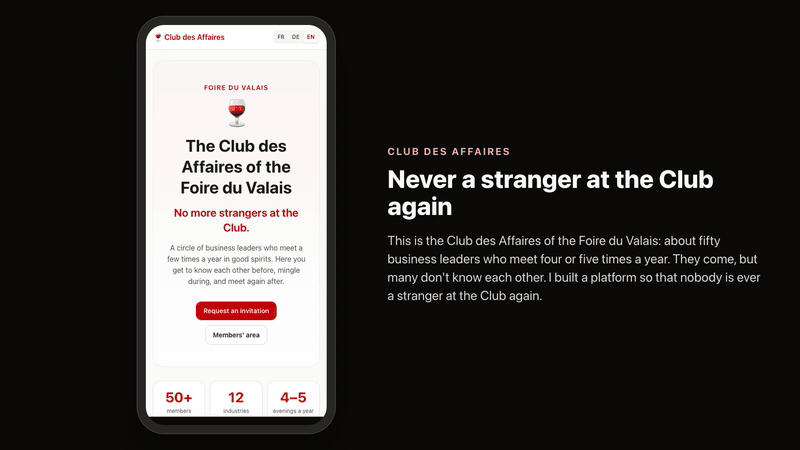

# Club des Affaires — Foire du Valais

[](docs/pitch/demo-long.mp4)

**▶ [Voir la démo commentée (3 min 15)](docs/pitch/demo-long.mp4)** · [lecture directe](https://github.com/MicrobAtomic/Meeting-project-Foire-du-Valais/raw/main/docs/pitch/demo-long.mp4) — en anglais,
avec la voix et les sous-titres. C'est le moyen le plus rapide de comprendre le projet : un prospect demande une
invitation, l'équipe l'accepte, Camille vit sa soirée, l'équipe prépare le dîner.

> **In English.** *Never a stranger at the Club again.* A members-only web app that keeps the business club of the
> Foire du Valais alive between its evenings: member cards (passions, what you can help with, what you look for),
> three introductions before each event with the reason why, a QR scan at the event that adds the card to your album
> and unlocks contact details, a people bingo computed for each guest and rotating tables at seated dinners, and shared
> milestones that show the Club growing closer. Django 5.2, FR / DE / EN, secure by default, 403 automated tests.

**Plus jamais d'inconnus au Club.** J'ai réalisé seul cette web app pour le hackathon de la Foire du Valais
(3 et 4 octobre 2026) : une plateforme réservée aux membres du Club des Affaires, qui suit le rythme des soirées.
Avant, chacun sait qui rencontrer et pourquoi ; pendant, un QR code prouve la rencontre et un jeu brise la glace ;
après, l'album se remplit et le Club voit qu'il se resserre.

## Le dossier, dans l'ordre

| | Document | Ce qu'on y trouve |
|---|---|---|
| 1 | [Le sujet et la solution](docs/SOLUTION.md) | Le défi, ce que le client m'a dit, la solution pilier par pilier, les parcours |
| 2 | [Les choix techniques](docs/ARCHITECTURE.md) | La stack, les options écartées et pourquoi, la sécurité, les algorithmes, les coûts |
| 3 | [Recruter et animer](docs/MARKETING.md) | Le plan de recrutement ciblé et le catalogue des jeux de soirée |
| 4 | [Le pitch](docs/PITCH.md) | Le texte de deux minutes, les questions du jury, les textes de soumission |
| 5 | [Mettre en service](docs/EXPLOITATION.md) | Hébergement, e-mails, photos, sauvegardes, données personnelles |

Le deck se trouve dans [docs/pitch/](docs/pitch/) (PowerPoint et PDF). Les plans de réalisation et les recettes sont
archivés dans [docs/archive/](docs/archive/).

## Lancer le projet en 5 minutes (macOS)

```bash
brew install uv                                   # une seule fois
git clone https://github.com/MicrobAtomic/Meeting-project-Foire-du-Valais.git
cd Meeting-project-Foire-du-Valais
uv venv --python 3.12 .venv && source .venv/bin/activate
uv pip install -r requirements.txt
export DEBUG=1                                    # mode développement
python manage.py migrate
python manage.py seed_demo                        # 50 membres fictifs, 5 événements
python manage.py runserver                        # http://127.0.0.1:8000
```

Les fois suivantes : `source .venv/bin/activate && export DEBUG=1 && python manage.py migrate && python manage.py runserver`
(`migrate` applique les évolutions de la base sans rien effacer). `python manage.py seed_demo --reset` remet toutes les
données de démo à zéro ; il faut alors se reconnecter.

Le mot de passe des trois comptes de démo est `club-demo-2026` (ou la valeur de `DEMO_PASSWORD`).

| Compte | Rôle |
|---|---|
| `camille.rey@example.com` | Nouvelle membre, 2 cartes dans son album : le compte de la démo |
| `lukas.imboden@example.com` | Pilier du Club depuis 2017, bilingue français-allemand |
| `equipe@example.com` | Équipe événements : `/staff/` et `/admin/` |

Toutes les personnes et entreprises sont fictives ; trois portraits illustratifs ont leurs sources dans
[docs/demo/PHOTOS.md](docs/demo/PHOTOS.md).

## Parcourir la démo en 2 minutes

1. **La vitrine** (déconnecté) : la promesse et « Demander une invitation » ; aucun nom de membre n'apparaît.
2. **Camille** : son accueil (album 2 / 49, le Club connecté à 15 %, le prochain palier), puis le *Dîner d'automne* et
   ses 3 rencontres : Lukas cherche du digital, elle cherche le marché alémanique.
3. **La rencontre** : ouvre le QR code de Lukas ci-dessous → « Ajouter Lukas à mon album » : ses coordonnées et sa vCard
   se débloquent, une case du bingo se coche.
4. **Le bingo** : *Dîner d'automne* → « Voir ma grille ».
5. **L'équipe** (`equipe@example.com`) : tableau de bord → *Dîner d'automne* → « Préparer » → le plan de tables se
   génère en direct (38 invités, 3 services). L'administration (`/admin/`) s'ouvre sur son mode d'emploi.
6. **Les langues** : FR · DE · EN en haut de page.


Le QR code de Lukas ouvre http://127.0.0.1:8000/m/demo-lukas/ (connecté en Camille). Pour une adresse en ligne :
`python manage.py demo_qr https://<adresse>`. Pour rejouer la rencontre : `python manage.py demo_reset` (Camille revient
à 2 cartes et à un bingo vierge, sans rien changer d'autre).

## Tests

```bash
env DEBUG=1 python manage.py test club      # 403 tests, environ 1 min ; 6 cas réservés à PostgreSQL
```

Ils couvrent les algorithmes, la matrice d'accès (toute nouvelle page doit être classée publique, membre ou équipe),
la sécurité des pages, les traductions (aucune phrase française ne doit rester sur une page allemande ou anglaise), la
confidentialité des notes et des photos, et la reproductibilité des données de démo. Le détail est dans
[ARCHITECTURE](docs/ARCHITECTURE.md#10-qualité).

## Structure du code

```
config/              réglages Django (sécurité, langues, base de données par variable d'environnement), routes
club/models.py       membres, affinités, thèmes d'entraide, événements, rencontres, bingo, remplaçants, notifications
club/services/       logique métier testée : matching, tables tournantes, bingo, fédération et paliers, e-mails…
club/views/          vitrine · espace membre · événements · bingo · équipe
club/admin.py        administration de l'équipe événements
templates/ static/   pages en FR / DE / EN, un peu de JavaScript sans dépendance, CSS Tailwind compilé
locale/              traductions
docs/                le dossier ci-dessus, le deck (pitch/) et les archives
```

Les règles pour reprendre le code avec un assistant IA sont dans [CLAUDE.md](CLAUDE.md).
